## Hakkımda

Backend geliştirme ve **mikroservis mimarileri** üzerine odaklanan bir **Bilgisayar Mühendisiyim** (Bartın Üniversitesi, 2026).
**Java ve Spring Boot** ile REST API geliştirme, servisler arası iletişim, **mesajlaşma sistemleri (Kafka, RabbitMQ)**, veritabanı yönetimi ve güvenli backend mimarileri üzerine çalışıyorum.
PiA Group'taki uzun dönem stajımda gerçek mikroservis sistemlerinde **API Gateway, Eureka, merkezi konfigürasyon, Docker, Kubernetes ve Keycloak** ile çalıştım; **Camunda BPMN** ile iş süreçlerini modelleyip onay akışlarını orkestre ettim.
Yüksek erişilebilirlik, güvenlik ve veri bütünlüğünün kritik olduğu **bankacılık ve finans** sistemlerinde ölçeklenebilir backend çözümleri geliştiren ekiplerde uzmanlaşmayı hedefliyorum.

<table><tr>
<td width="50%"></td>
<td width="50%"></td>
</tr></table>

## Deneyim

**Uzun Dönem Java Backend Developer Stajyeri — PiA Group** · `02.2026 – 06.2026`
- **Java ve Spring Boot** ile mikroservis tabanlı backend servislerinin geliştirilmesinde görev aldım; servisler arası iletişim için **RESTful API**'ler tasarladım.
- **API Gateway, Service Discovery (Eureka)** ve merkezi konfigürasyon yapılarıyla çalıştım.
- **Kafka ve RabbitMQ** ile event-driven mimari yapıları deneyimledim.
- **Docker** ile container ortamında dağıtıma katkı sağladım; **Kubernetes ve Keycloak** ile ölçekleme ve güvenlik üzerine çalıştım.
- **MySQL ve Spring Data JPA** ile veritabanı işlemleri; **Resilience4j (Circuit Breaker)** ile temel hata toleransı.
- **Camunda BPMN** ile iş süreçlerinin modellenmesi, onay akışlarının orkestrasyonu ve workflow yönetimi.

**Trainee — Google Oyun ve Uygulama Akademisi** · `10.2023 – 06.2024`
- **Flutter** ile mobil uygulama geliştirme; Game & App Jam ve AI Plugin App Jam etkinliklerinde hızlı prototipleme.
- İhtiyaç analizi, arayüz tasarımı ve uygulama mimarisi; **Firebase** ile backend entegrasyonları.

## Öne Çıkan Projeler

<table><tr>
<td width="50%"></td>
<td width="50%"></td>
</tr></table>

## Teknolojiler

  <b>Backend & Mikroservis</b> 
    
  <b>DevOps & Araçlar</b> 
    
  <b>Frontend & Diğer</b> 
  

## Eğitim

**Bilgisayar Mühendisliği (Lisans)** — Bartın Üniversitesi · `2022 – 2026` · GNO **3,37**
 **Özden Cengiz Anadolu Lisesi** — İstanbul · `2017 – 2021`

## Sertifikalar & Diller

- Google Proje Yönetimi — *Coursera*
- Türkçe (ana dil) · İngilizce (B1–B2, sertifikalı)

